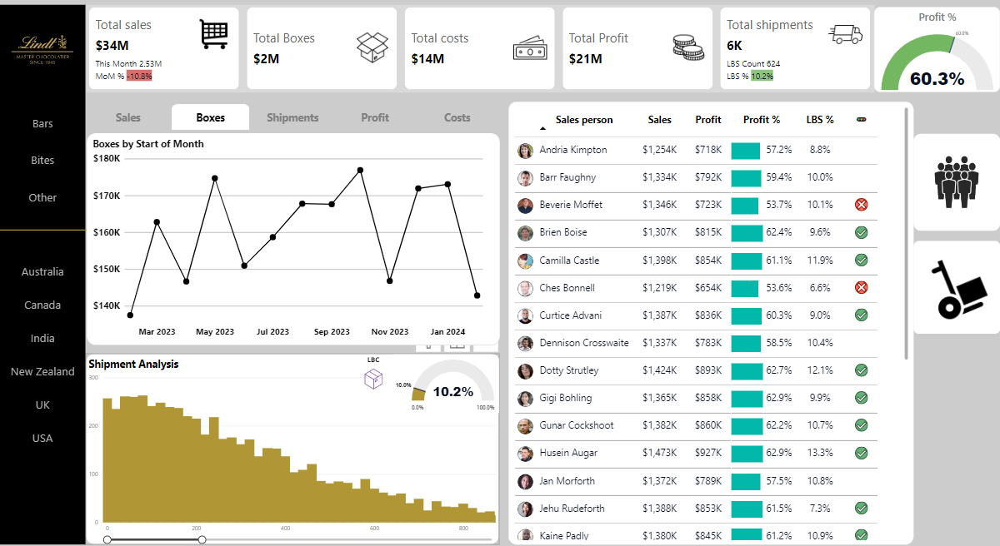

# **Power BI Sales Dashboard**

This repository contains a Power BI dashboard designed to visualize and analyze sales data. The dashboard provides insights into various sales metrics, helping users understand sales performance, trends, and patterns.

## **See the Full Dash Board Here**   

[App PowerBI Link](https://app.powerbi.com/links/39h6MJw56h?ctid=17f1a87e-2a25-4eaa-b9df-9d439034b080&pbi_source=linkShare&bookmarkGuid=3b591a33-96ce-4518-a38d-bbaa10998db9)

  
 
### **Features**

**Sales Overview**: A comprehensive view of total sales, total boxes sold, total costs, and total profit. It also includes the month-over-month (MoM) growth percentage.  
**Product Performance**: Detailed analysis of sales, profit, and profit percentage by product. The dashboard highlights the top-performing products and provides a visual representation of profit margins.  
**Boxes Analysis**: A line chart showing the number of boxes sold by the start of each month, helping to identify trends over time.  
**Shipment Analysis**: A histogram and percentage gauge showing shipment details, including the LBS (pounds) percentage and Low Box Count (LBC) percentage.  
**Salesperson Performance**: Analysis of sales, profit, profit percentage, and LBS percentage by salesperson.  
**Geographic Breakdown**: Sales data segmented by different regions, including Australia, Canada, India, New Zealand, UK, and USA.  
**Interactive Elements**: The dashboard includes interactive elements such as tabs for different categories (Bars, Bites, Other) and visual indicators (e.g., checkmarks and crosses) for easy interpretation of product performance.  

### **Explanation of Metrics**

**Total Sales**: The total revenue generated from sales.  
**Total Boxes**: The total number of boxes sold.  
**Total Shipments**: The total number of shipments, easily figured out from the shipment table.  
**Total Costs**: Calculated from the product table by taking the cost per box.  
**Total Profit**: The difference between total sales and total costs.  
**Profit Percentage**: The percentage of profit relative to sales.  
**Low Box Count (LBC)**: A metric indicating the number of low box counts.  
**Low Box Percentage (LBC%)**: The percentage of low box counts relative to total boxes.  
**Month on Month (MoM)**: Growth percentage comparing the current month to the previous month.  
**Year on Year (YoY)**: Growth percentage comparing the current year to the previous year.  

### **Files**

**Sales_Dashboard.pbix**: The main Power BI dashboard file.  
**Data Sources**: Folder containing sample data sources used in the dashboard (ac-sample-data.xlsx).  
**README.md**: This file, providing an overview of the repository and instructions for use.  

### **How to Use**

Download the .pbix file: Clone the repository or download the Sales_Dashboard.pbix file directly.  
Open in Power BI Desktop: Open the .pbix file using Power BI Desktop.  
Refresh Data: Connect your data sources and refresh the data to see the latest insights.  
Explore the Dashboard: Use the interactive visuals to explore and analyze the sales data.  

### **Access the Dashboard Online**  
You can view the dashboard online via this Power BI link.  
[App PowerBI Link](https://app.powerbi.com/view?r=eyJrIjoiNzVkNzUwMWMtNGM4Yy00YTQ2LTg5ZDEtMmYyOTA4NmQ3YWQ2IiwidCI6IjE3ZjFhODdlLTJhMjUtNGVhYS1iOWRmLTlkNDM5MDM0YjA4MCIsImMiOjF9)

**Contributing**  
Feel free to fork this repository, make enhancements, and submit pull requests. Your contributions are welcome!  

**License**  
This project is licensed under the MIT License - see the LICENSE file for details.  
